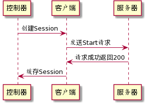
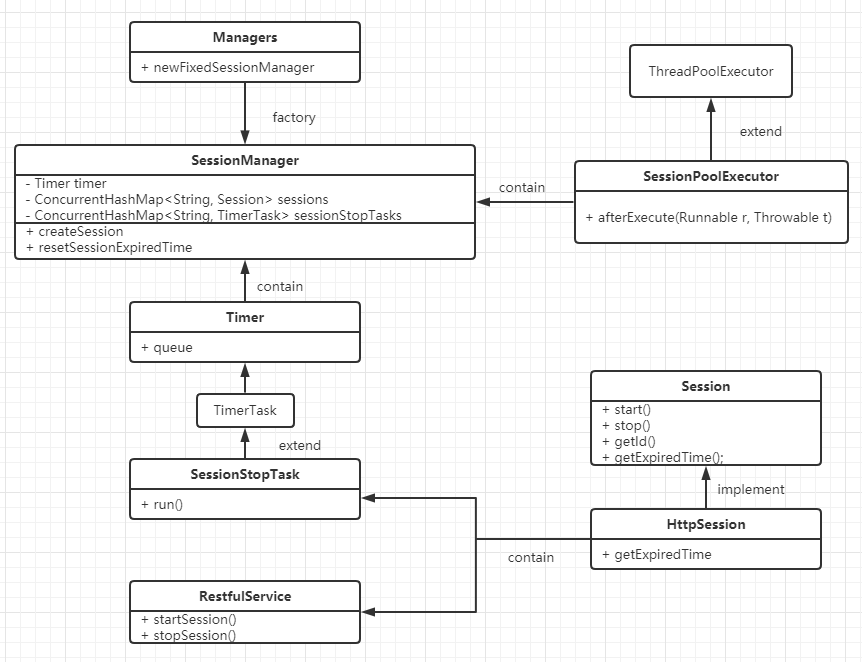

# Session控制器

## 项目说明

#### 基础环境 

- JDK: 版本1.8
- Maven: 版本3.5及以上
- IDEA集成开发环境

#### 构建项目

项目拉取到本地后，使用IDEA打开pom文件加载为project，刷新Maven拉取对应的依赖，执行下面命令进行项目构建及测试运行

```shell
mvn clean verify
```

测试用例涵盖了SessionManager的公开方法，包含创建Session功能，删除Session功能，更改Session过期时间功能，批量关闭Session功能（优雅关闭）。

测试基本覆盖率了SessionManager的常用功能。

> 完成构建后，整个项目的环境就准备完成了，并且会在target/generated-sources/jaxb/com/lee/generate目录下根据定义的schema生成对应的Java对象
>
> 如果没有生成对应文件，且项目报缺少类，可以单独执行`mvn jaxb2:xjc`，生成对应文件

#### 启动http服务器

在包 `com.lee` 下执行 `Server.class` 的 `main` 方法，启动服务器，http服务器对所有的请求会回复200，并打印相关的连接信息，启动成功后会打印一下信息

```shell
2020-09-20 22:52:22 [main] INFO  [com.lee.Server] - Server started on port 8081
```

#### 启动Session控制器（Client）

在包 `com.lee` 下执行 `Client.class` 的 `main` 方法，客户端将会启动，启动成功后会打印以下信息

```shell
请输入固定指令指令执行session操作：
查看Session: ls
添加Session: 
1.添加单个session：add sessionId timeout(负数表示不过期） -> add 1000 2000（创建一个id为1000，过期时间为2秒的session）
2.并发添加多个session：add session个数 -> add 10（创建10个Session，默认不过期）
修改Session过期时间: 
modify sessionId timeout -> modify 1000 5000(负数表示不过期)（修改Id为1000的Session过期时间为5秒后）
q退出程序，退出前会将所有Session关闭
```

> Client的操作采用命令行的输入进行操作，动态的改变Session的行为（新建，关闭）

#### 日志系统

采用的日志框架为logback，默认会记录所有info等级的日志，并将错误日志单独放入一个日志文件中。

## Session控制器操作

#### 创建一个Session

创建一个Session可以使用add命令，下面创建了一个SessionId为1234的会话，过期的时间为5秒

```shell
$ add 1234 5000
```

- 客户端日志

  客户端会打印如下信息

```shell
2020-09-20 23:00:30 [session-01-thread-1] INFO  [com.lee.api.RestfulService] - Session1234创建成功！请求开始时间[2020-09-20 23:00:28],请求url[http://127.0.0.1:8081/nbi/deliverysession?id=1234],请求体[{"action":"START","deliverySessionId":1234,"startTime":1600614028318,"stopTime":-1,"version":"1.0.0"}],Session状态[新建]
2020-09-20 23:00:30 [session-01-thread-1] INFO  [com.lee.manager.SessionManager] - 创建Session1234成功，当前存活的Session个数为1个
2020-09-20 23:00:30 [session-01-thread-1] INFO  [com.lee.manager.SessionManager] - Session1234设置的存活时间为5秒，将会在2020-09-20 23:00:35关闭，剩余时间0分5秒
```

​	5秒后，会打印过期的日志

```shell
2020-09-20 23:00:35 [httpSession-stop-timer] INFO  [com.lee.manager.SessionManager] - Session1234存活时间到期，将会被自动删除
2020-09-20 23:00:36 [httpSession-stop-timer] INFO  [com.lee.api.RestfulService] - Session1234停止成功！请求开始时间[2020-09-20 23:00:35],请求url[http://127.0.0.1:8081/nbi/deliverysession?id=1234],请求体[{"action":"STOP","deliverySessionId":1234,"startTime":1600614035588,"stopTime":1600614035587,"version":"1.0.0"}],Session状态[停止]
2020-09-20 23:00:36 [httpSession-stop-timer] INFO  [com.lee.manager.SessionManager] - 删除Session1234成功，当前存活的Session个数为0个
```

- 服务端日志

```shell
2020-09-20 23:00:30 [pool-1-thread-1] INFO  [com.lee.Server] - [Session1234]连接，当前Session[1]个
2020-09-20 23:00:36 [pool-1-thread-3] INFO  [com.lee.Server] - [Session1234]断开，服务器当前Session[0]个
```

#### 批量创建Session

批量创建Session的时候，会使用默认的SessionId进行创建，Id是递增的，创建的过程是非阻塞并发执行的。通过修改add后的数量参数，就可以控制并发数

下面命令创建5个Session，创建的Session默认是不会过期的。

```shell
$ add 5
```

- 客户端日志

```shell
2020-09-20 23:03:41 [session-01-thread-3] INFO  [com.lee.api.RestfulService] - Session100002创建成功！请求开始时间[2020-09-20 23:03:39],请求url[http://127.0.0.1:8081/nbi/deliverysession?id=100002],请求体[{"action":"START","deliverySessionId":100002,"startTime":1600614218903,"stopTime":-1,"version":"1.0.0"}],Session状态[新建]
2020-09-20 23:03:41 [session-01-thread-5] INFO  [com.lee.api.RestfulService] - Session100004创建成功！请求开始时间[2020-09-20 23:03:39],请求url[http://127.0.0.1:8081/nbi/deliverysession?id=100004],请求体[{"action":"START","deliverySessionId":100004,"startTime":1600614218903,"stopTime":-1,"version":"1.0.0"}],Session状态[新建]
2020-09-20 23:03:41 [session-01-thread-4] INFO  [com.lee.api.RestfulService] - Session100003创建成功！请求开始时间[2020-09-20 23:03:39],请求url[http://127.0.0.1:8081/nbi/deliverysession?id=100003],请求体[{"action":"START","deliverySessionId":100003,"startTime":1600614218903,"stopTime":-1,"version":"1.0.0"}],Session状态[新建]
2020-09-20 23:03:41 [session-01-thread-1] INFO  [com.lee.api.RestfulService] - Session100000创建成功！请求开始时间[2020-09-20 23:03:39],请求url[http://127.0.0.1:8081/nbi/deliverysession?id=100000],请求体[{"action":"START","deliverySessionId":100000,"startTime":1600614218903,"stopTime":-1,"version":"1.0.0"}],Session状态[新建]
2020-09-20 23:03:41 [session-01-thread-5] INFO  [com.lee.manager.SessionManager] - 创建Session100004成功，当前存活的Session个数为2个
2020-09-20 23:03:41 [session-01-thread-3] INFO  [com.lee.manager.SessionManager] - 创建Session100002成功，当前存活的Session个数为2个
2020-09-20 23:03:41 [session-01-thread-4] INFO  [com.lee.manager.SessionManager] - 创建Session100003成功，当前存活的Session个数为3个
2020-09-20 23:03:41 [session-01-thread-2] INFO  [com.lee.api.RestfulService] - Session100001创建成功！请求开始时间[2020-09-20 23:03:39],请求url[http://127.0.0.1:8081/nbi/deliverysession?id=100001],请求体[{"action":"START","deliverySessionId":100001,"startTime":1600614218903,"stopTime":-1,"version":"1.0.0"}],Session状态[新建]
2020-09-20 23:03:41 [session-01-thread-1] INFO  [com.lee.manager.SessionManager] - 创建Session100000成功，当前存活的Session个数为4个
2020-09-20 23:03:41 [session-01-thread-2] INFO  [com.lee.manager.SessionManager] - 创建Session100001成功，当前存活的Session个数为5个
```

- 服务端日志

```shell
2020-09-20 23:03:41 [pool-1-thread-6] INFO  [com.lee.Server] - [Session100001]连接，当前Session[1]个
2020-09-20 23:03:41 [pool-1-thread-5] INFO  [com.lee.Server] - [Session100003]连接，当前Session[2]个
2020-09-20 23:03:41 [pool-1-thread-7] INFO  [com.lee.Server] - [Session100000]连接，当前Session[3]个
2020-09-20 23:03:41 [pool-1-thread-9] INFO  [com.lee.Server] - [Session100004]连接，当前Session[4]个
2020-09-20 23:03:41 [pool-1-thread-8] INFO  [com.lee.Server] - [Session100002]连接，当前Session[5]个
```

#### 动态修改Session的过期时间

Session在未过期之前可以重新定义过期时间，下面命令重新设置了id为100001的Session的过期时间，设置完成后，会重置对应Session的过期时间

```shell
$ modify 100001 30000
```

修改后日志

```shell
2020-09-20 23:11:12 [main] INFO  [com.lee.manager.SessionManager] - Session100001重置了过期时间
2020-09-20 23:11:12 [main] INFO  [com.lee.manager.SessionManager] - Session100001设置的存活时间为30秒，将会在2020-09-20 23:11:42关闭，剩余时间0分29秒
```

过期的后日志

```shell
2020-09-20 23:11:42 [httpSession-stop-timer] INFO  [com.lee.manager.SessionManager] - Session100001存活时间到期，将会被自动删除
2020-09-20 23:11:43 [httpSession-stop-timer] INFO  [com.lee.api.RestfulService] - Session100001停止成功！请求开始时间[2020-09-20 23:11:42],请求url[http://127.0.0.1:8081/nbi/deliverysession?id=100001],请求体[{"action":"STOP","deliverySessionId":100001,"startTime":1600614702369,"stopTime":1600614702368,"version":"1.0.0"}],Session状态[停止]
2020-09-20 23:11:43 [httpSession-stop-timer] INFO  [com.lee.manager.SessionManager] - 删除Session100001成功，当前存活的Session个数为4个
```

再次对相同的Session进行操作，会给出错误提示

```shell
$ modify 100001 30000
指令错误: 重置的Session100001不存在
```

#### 查看Session状态

使用 `ls` 命令可以查看所有未过期Session的状态

```shell
$ ls
当前Session个数4个
SessionId: 100000 过期时间: 不过期 剩余时间：不过期
SessionId: 100002 过期时间: 不过期 剩余时间：不过期
SessionId: 100003 过期时间: 不过期 剩余时间：不过期
SessionId: 100004 过期时间: 不过期 剩余时间：不过期
```

#### 退出Session管理器

使用`q` 命令退出Session管理器，并在退出之前关闭所有的Session

```shell
$ q
2020-09-20 23:15:27 [main] INFO  [com.lee.manager.SessionManager] - sessionManager即将关闭
2020-09-20 23:15:28 [session-01-thread-3] INFO  [com.lee.api.RestfulService] - Session100004停止成功！请求开始时间[2020-09-20 23:15:27],请求url[http://127.0.0.1:8081/nbi/deliverysession?id=100004],请求体[{"action":"STOP","deliverySessionId":100004,"startTime":1600614927378,"stopTime":-1,"version":"1.0.0"}],Session状态[停止]
2020-09-20 23:15:28 [session-01-thread-3] INFO  [com.lee.manager.SessionManager] - 删除Session100004成功，当前存活的Session个数为3个
2020-09-20 23:15:28 [session-01-thread-7] INFO  [com.lee.api.RestfulService] - Session100002停止成功！请求开始时间[2020-09-20 23:15:27],请求url[http://127.0.0.1:8081/nbi/deliverysession?id=100002],请求体[{"action":"STOP","deliverySessionId":100002,"startTime":1600614927380,"stopTime":-1,"version":"1.0.0"}],Session状态[停止]
2020-09-20 23:15:28 [session-01-thread-7] INFO  [com.lee.manager.SessionManager] - 删除Session100002成功，当前存活的Session个数为2个
2020-09-20 23:15:28 [session-01-thread-8] INFO  [com.lee.api.RestfulService] - Session100003停止成功！请求开始时间[2020-09-20 23:15:27],请求url[http://127.0.0.1:8081/nbi/deliverysession?id=100003],请求体[{"action":"STOP","deliverySessionId":100003,"startTime":1600614927380,"stopTime":-1,"version":"1.0.0"}],Session状态[停止]
2020-09-20 23:15:28 [session-01-thread-6] INFO  [com.lee.api.RestfulService] - Session100000停止成功！请求开始时间[2020-09-20 23:15:27],请求url[http://127.0.0.1:8081/nbi/deliverysession?id=100000],请求体[{"action":"STOP","deliverySessionId":100000,"startTime":1600614927380,"stopTime":-1,"version":"1.0.0"}],Session状态[停止]
2020-09-20 23:15:28 [session-01-thread-8] INFO  [com.lee.manager.SessionManager] - 删除Session100003成功，当前存活的Session个数为1个
2020-09-20 23:15:28 [session-01-thread-6] INFO  [com.lee.manager.SessionManager] - 删除Session100000成功，当前存活的Session个数为0个
```

## 算法说明

下面时序图说明了，所有的操作都是由sessionManager发起并完成的，Session必须注册相应的sessionManager才能被管理对应的生命周期。



- Session缓存

Session控制器本质上是一个缓存了Session的Map数据结构，每一个Session在收到服务器响应后就会被缓存至Map中，能够满足并发创建多个Session，为了保证并发的安全性，使用的数据结构是`ConcurrentHashMap`。

- 过期Session的处理

Session过期是由定时器触发的，定时器触发时，会向服务器发送Stop请求，并将Session从缓存Map中移除

- 实现异步创建Session

多线程发送请求，使用了一个自定义的线程池，继承了`ThreadPoolExecutor`，创建Session的个数和线程池的工作线程一一对应，每个线程都向服务器请求，添加任务至Map，对于设置了超时时间的任务，还会执行定时任务的设置。

- 设置定时任务

定时任务也会缓存在一个`ConcurrentHashMap`中，以便更好的进行修改操作

定时任务使用JDK自带的Timer类实现，每一个定时任务都会被包装成`SessionManager`的内部类，设置为延时任务，并放入到Timer的任务队列中去。

- 重置过期时间

从定时任务的缓存中取出对应Session的定时任务，取消其执行，并替换一个成新的定时任务，重新开始计时。

- 优雅关闭控制器

关闭控制器的时候，很有可能Session还未过期。在关闭Session控制器的时候，首先取消掉Timer的所有未执行的任务，并且将定时任务Map中的任务全部取消，清空。再对Session缓存中的每个Session调用remove的动作，等执行线程池的`shutdown`方法，程序会在全部Session移除完成后，退出。

#### 核心类

下图展示了几个核心类的关系



- Managers是生产SessionManager的工厂方法
- SessionManager是管理Session的核心类，里面包含了用于执行定时任务的`Timer`类，用于执行并发任务的`SessionPoolExecutor`类，还包含了两个管理Session和Session定时任务的Map容器
- SessionPoolExecutor是用于执行任务的线程池，核心线程数大小就是并发数的大小。也自定义了拒绝策略，在有界队列满了的时候，会执行（这一点在这里也没能体现很好，因为是通过改变核心线程数来实现的并发请求，所以不会触发拒绝策略），同时重写了afterExecute方法，对线程抛出的错误进行了处理。
- TimerTask类是用来定义定时任务的类，继承了默认的`TimerTask`类，其中包含了一个Session，用于执行Session相应的操作
- Session接口，可以作为Session的抽象，当需要有不同Session类时，通过实现接口就可以与系统进行交互（这个特性在这个作业中体现的不是很好，并没有能做到面向接口编程）

## 总结

这个作业中应用线程池的特性完成了并发请求的要求，并且通过缓存Session和对应的定时任务实现了对Session生命周期的管理以及动态更改定时任务的功能，利用线程池的生命周期，实现了优雅的关闭应用。
